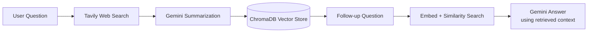

# 🔎 Smart Research Assistant

A research assistant that searches the live web, summarizes findings with Gemini, stores them as vector memory in ChromaDB, and answers follow-up questions grounded in that stored context — all through a simple Streamlit UI.

## Overview

Ask a question, and the app:

1. Searches the web in real time using the **Tavily Search API**.
2. Summarizes the search results into a clear, factual answer using **Google Gemini**.
3. Embeds and stores that summary in a **ChromaDB** vector collection, tagged with the original query and sources.
4. On follow-up questions, retrieves the most relevant stored summaries via semantic similarity and asks Gemini to answer using only that retrieved context (a lightweight Retrieval-Augmented Generation loop).



## Features

- Live web search via Tavily (advanced search depth, multiple sources per query)
- AI summarization via Gemini (`gemini-3.5-flash`)
- Semantic vector memory via ChromaDB, embedded with Gemini (`gemini-embedding-001`)
- Follow-up Q&A grounded in previously researched topics, not just the model's general knowledge
- Source attribution for every summary
- Minimal, tab-based Streamlit interface (New Research / Ask a Follow-up)
- Runs locally or in Google Colab (via a Cloudflare quick tunnel)

## Tech Stack

| Layer | Tool |
|---|---|
| UI | [Streamlit](https://streamlit.io) |
| Web search | [Tavily](https://tavily.com) |
| LLM / Embeddings | [Google Gemini API](https://ai.google.dev) (`google-genai` SDK) |
| Vector store | [ChromaDB](https://www.trychroma.com) |
| Config | `python-dotenv` |

## Prerequisites

- Python 3.10+
- A [Tavily API key](https://tavily.com) (free tier available)
- A [Google Gemini API key](https://aistudio.google.com/apikey) (free tier available)
- `google-genai` version **2.0.0 or higher** (the Interactions API used here requires it)

## Setup

### 1. Clone the repository

```bash
git clone <your-repo-url>
cd <your-repo-name>
```

### 2. Install dependencies

```bash
pip install streamlit tavily-python "google-genai>=2.0.0" chromadb python-dotenv
```

### 3. Configure environment variables

Copy the example file and fill in your own keys:

```bash
cp .env.example .env
```

Then edit `.env`:

```
GOOGLE_API_KEY="your-actual-gemini-key"
TAVILY_API_KEY="your-actual-tavily-key"
```

### 4. Run the app

**Locally:**

```bash
streamlit run app.py
```

**In Google Colab:** Colab can't expose `localhost` directly, so the app is launched in the background and exposed through a Cloudflare quick tunnel. See the companion Colab notebook for the exact cell sequence (install deps → load `.env` → write `app.py` → download `cloudflared` → launch app + tunnel).

## Environment Variables

| Variable | Required | Description |
|---|---|---|
| `GOOGLE_API_KEY` | Yes | Gemini API key, used for both summarization/answering and embeddings |
| `TAVILY_API_KEY` | Yes | Tavily API key, used for live web search |
| `CHROMA_DB_DIR` | No | Local path for persistent ChromaDB storage. **Not yet wired into the default app**, which uses in-memory (ephemeral) storage scoped to the current session — provided for future use if you switch to a `PersistentClient` |

## Project Structure

```
.
├── app.py            # Streamlit app: search, summarize, store, retrieve, answer
├── .env.example       # Template for required API keys
├── .gitignore
└── README.md
```

## Usage

- **New research** tab: type a question, click *Research*. The app searches the web, summarizes the results with Gemini, displays the summary with its sources, and stores it in ChromaDB.
- **Ask a follow-up** tab: ask a question about anything you've researched in the current session. The app retrieves the most relevant stored summaries and answers using only that context, noting if the context isn't sufficient.
- The sidebar shows how many research entries are stored this session, with a button to clear all stored memory.

## Known Limitations

- **Memory is session-scoped.** Stored research lives in an in-memory ChromaDB collection and is cleared when the app process restarts. For persistence across restarts, switch to `chromadb.PersistentClient(path=os.getenv("CHROMA_DB_DIR"))`.
- **Colab tunnels are ephemeral.** Each time you relaunch the app in Colab, you'll get a new public URL.
- **Follow-up answers are limited to stored research.** If nothing relevant has been researched yet, the assistant will say so rather than fall back to a fresh web search (by design, to keep the RAG loop predictable).

## Troubleshooting

**`google.genai._interactions.BadRequestError: legacy Interactions API schema is no longer supported`**
Your installed `google-genai` SDK is below 2.0.0. Upgrade it and make sure no stale process is still running the old version:

```bash
pip install -U "google-genai>=2.0.0"
pkill -f streamlit   # kill any old running instance before relaunching
```

**Tunnel shows a `Failed to fetch dynamically imported module` error in the browser**
This is a known quirk with some free tunneling services serving an interstitial page instead of the actual asset. Use a Cloudflare quick tunnel (`cloudflared tunnel --url http://localhost:8501`) instead, which doesn't have this issue.

## License

This project doesn't currently include a license file. Add a `LICENSE` (e.g. MIT) if you intend to share or open-source this repository.
